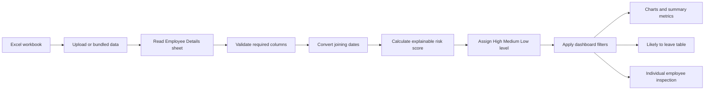
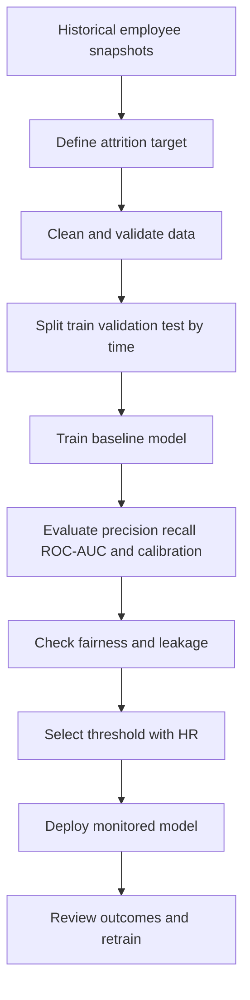

# Stackly Attrition Radar
## Project explanation and team-lead presentation guide

**Version:** 1.0  
**Application:** Streamlit  
**Input:** `data/stackly_employee_details.xlsx`  
**Current status:** Working prototype / explainable screening dashboard

---

## 1. Executive Summary

Stackly Attrition Radar is a small HR analytics dashboard that reads employee details from Excel and highlights employees with elevated attrition-risk signals.

The dashboard helps a manager:

- see how many employees are in each risk category;
- identify employees who need attention first;
- understand *why* an employee was flagged;
- filter the results by department, location, and risk level; and
- inspect one employee in more detail.

### Important technical truth

The current Excel file contains employee information, but it does **not** contain a historical `Attrition` result such as `Yes` or `No`. Because of that, the current application does not train a machine-learning model. It uses a transparent, rule-based scoring method called an **explainable heuristic**.

This is appropriate for a prototype demonstration. It should not be presented as a validated prediction model until historical attrition labels are collected and the model is tested against real outcomes.

---

## 2. Business Problem

Employee turnover can create recruitment cost, productivity loss, knowledge loss, and team disruption. HR or team leaders need an early-warning view to decide where a retention conversation may be useful.

The business question is:

> Which employees show elevated signals associated with possible attrition, and what signals contributed to the result?

The dashboard is designed for **prioritization**, not for making an automatic employment decision.

---

## 3. Project Architecture



### Main files

| File | Purpose |
|---|---|
| `app.py` | Streamlit interface, data loading, scoring logic, charts, filters, and employee details |
| `data/stackly_employee_details.xlsx` | Bundled sample input containing 50 employees |
| `requirements.txt` | Python packages required to run the app |
| `README.md` | Short setup and run instructions |
| `docs/ATTRITION_PROJECT_GUIDE.md` | Full technical and presentation explanation |

---

## 4. Data Used

The workbook has 50 sample employee records and these columns:

| Field | Meaning | Used by current score? |
|---|---|---:|
| Employee ID | Unique employee identifier | No, identification only |
| Full Name | Employee display name | No, identification only |
| Department | Business department | Yes |
| Job Title | Current position | No, displayed for context |
| Email | Company email | No, not displayed in risk calculations |
| Phone | Contact number | No, not used for scoring |
| Location | Primary work location | Yes |
| Joining Date | Start date | Yes, converted to tenure |
| Employment Status | Active, On Leave, or Probation | Yes |

### Data quality checks in the app

1. The workbook must contain an `Employee Details` sheet.
2. The required columns must be present.
3. `Joining Date` is converted to a date value.
4. Invalid dates become missing values instead of crashing the app.
5. The dashboard stops with a clear error if required columns are missing.

### Privacy note

The email and phone fields are retained in the workbook, but they are not needed for scoring. In a production version, access should be restricted and personally identifiable information should be minimized.

---

## 5. Current Method: Explainable Heuristic Scoring

For each employee, the app starts with a score of zero and adds points when a risk signal is present.

### Scoring rules

| Signal | Points | Reason shown in dashboard |
|---|---:|---|
| Tenure under 1 year | +35 | `under 1 year tenure` |
| Tenure from 1 to under 2 years | +20 | `under 2 years tenure` |
| Employment status is On Leave | +30 | `currently on leave` |
| Employment status is Probation | +25 | `in probation` |
| Location is Remote | +10 | `remote location` |
| Department is Sales or Customer Success | +10 | `customer-facing team` |
| No matching signal | +0 | `no elevated signals` |

The final score is capped at 100.

### Formula

```text
Risk Score = tenure points
           + status points
           + location points
           + department points

Risk Score = min(Risk Score, 100)
```

The score is a prioritization index. It is **not** a probability that an employee will leave.

### Risk categories

| Score | Dashboard level | Interpretation |
|---:|---|---|
| 0-29 | Low | No strong elevated signals in this prototype |
| 30-54 | Medium | Review the employee context and consider a check-in |
| 55-100 | High | Highest priority for human review |

### Pseudocode

```text
for each employee:
    score = 0
    reasons = []

    calculate years since Joining Date
    if tenure < 1 year:
        add 35 points and record reason
    else if tenure < 2 years:
        add 20 points and record reason

    if Employment Status is On Leave:
        add 30 points and record reason
    else if Employment Status is Probation:
        add 25 points and record reason

    if Location is Remote:
        add 10 points and record reason

    if Department is Sales or Customer Success:
        add 10 points and record reason

    classify score as High, Medium, or Low
    display score and reasons
```

---

## 6. Current Sample Result

Using the bundled 50-row workbook, the current dashboard produces:

| Risk level | Employees | Average score |
|---|---:|---:|
| High | 2 | 57.5 |
| Medium | 2 | 47.5 |
| Low | 46 | 3.7 |

### Employees requiring first review

| Employee | Score | Level | Reasons |
|---|---:|---|---|
| Leah Lee (`STK-048`) | 60 | High | Under 2 years tenure, currently on leave, customer-facing team |
| Michael Taylor (`STK-049`) | 55 | High | Under 2 years tenure, in probation, remote location |
| Karan Khan (`STK-047`) | 50 | Medium | Under 2 years tenure, currently on leave |
| Neha Singh (`STK-050`) | 45 | Medium | Under 2 years tenure, in probation |

These are **screening results**, not statements that these employees will leave. A manager should validate the context through an appropriate, respectful conversation and other approved HR information.

---

## 7. Dashboard Components

### Header

The `Attrition Radar` title communicates the purpose. The subtitle explains that the dashboard is an early screening view.

### Sidebar

- Upload an alternative `.xlsx` workbook.
- Filter by department.
- Filter by risk level.
- Filter by location.

If no workbook is uploaded, the bundled sample workbook is used automatically.

### Summary metrics

- **Employees shown:** number of employees after filters.
- **High risk:** number of employees with score 55 or above.
- **Medium risk:** number of employees with score between 30 and 54.
- **Average score:** average score for the filtered group.

### Likely to leave table

This is the main decision-support view. It shows only High and Medium employees and includes the `Risk Signals` column so the reason is visible beside the person.

### Risk distribution graph

A bar chart shows how many employees are High, Medium, and Low risk. This gives a quick view of the overall population.

### Risk by department graph

A bar chart shows the average risk score by department. It helps the team lead see whether elevated scores are concentrated in a particular group.

### Employee risk list

The full filtered employee table includes a progress-bar style score and the explanation for each score.

### Inspect one employee

The select box shows risk score, risk level, employment status, location, and signals for one selected employee.

---

## 8. End-to-End Steps to Demonstrate

1. Open `http://localhost:8501`.
2. Explain that the app loads the bundled Excel file automatically.
3. Point to the four summary metrics.
4. Show the `Likely to leave` table first.
5. Explain that each row has a score and a reason, not only a label.
6. Open the risk distribution graph and explain the High, Medium, and Low groups.
7. Open the department graph and discuss concentration by department.
8. Use the sidebar to filter to High risk.
9. Filter by a department or location to demonstrate interactive analysis.
10. Select one employee in `Inspect one employee`.
11. Explain that a manager should validate the signal and should not treat the score as a final decision.
12. Finish by describing the data needed for a production ML model.

---

## 9. Technology Stack

| Technology | Role |
|---|---|
| Python | Application language |
| Pandas | Read Excel data, transform dates, group data, and create result tables |
| OpenPyXL | Excel engine used by Pandas to read `.xlsx` files |
| Streamlit | Web dashboard framework |
| Altair / Streamlit charts | Chart rendering through Streamlit |
| HTML/CSS | Small amount of custom styling for the dashboard appearance |

### Runtime flow

```text
Start Streamlit
  -> load app.py
  -> load uploaded workbook or bundled workbook
  -> validate columns
  -> calculate score for every row
  -> render filters, metrics, charts, and tables
  -> recalculate the visible results when a filter changes
```

---

## 10. How to Run the Project

From PowerShell:

```powershell
cd "$HOME\Downloads\stackly_attrition_prediction"
python -m pip install -r requirements.txt
python -m streamlit run app.py
```

Then open:

```text
http://localhost:8501
```

To stop the app, return to the terminal running Streamlit and press `Ctrl+C`.

---

## 11. What Is Missing for a True ML Model?

A real attrition model needs historical examples where the outcome is known.

### Required target column

Add a historical outcome such as:

- `Attrition`: `Yes` or `No`; or
- `Left Company`: `1` or `0`.

The label must represent an outcome from a defined observation window, for example: “Did the employee leave within the next 6 months?”

### Recommended additional features

- Age band, where legally and ethically appropriate
- Tenure in months
- Salary band or compensation position
- Promotion history
- Performance trend
- Absence or leave pattern, handled carefully
- Overtime or workload indicator
- Manager or team changes
- Engagement survey result
- Training and career-development activity
- Commute or work-mode information, where appropriate
- Previous internal transfers

Sensitive attributes should be reviewed for fairness and may need to be excluded from prediction while being retained for bias testing.

### Production ML workflow



### Suitable algorithms

Start with an interpretable baseline:

1. **Logistic Regression**: produces an estimated probability and is easy to explain.
2. **Decision Tree**: gives human-readable decision paths but can overfit.
3. **Random Forest**: captures non-linear patterns and is more robust, but less transparent.
4. **Gradient Boosting**: often strong on tabular data, but requires careful tuning and explanation.

For this use case, Logistic Regression plus explainability is a sensible first production baseline. A tree-based model can be compared against it, but accuracy should not be the only selection criterion.

### Evaluation metrics

- **Precision:** Of the people flagged, how many actually left?
- **Recall:** Of the people who left, how many were flagged?
- **F1 score:** Balance of precision and recall.
- **ROC-AUC:** Ranking quality across thresholds.
- **PR-AUC:** Useful when attrition is relatively rare.
- **Calibration:** Whether a predicted 0.70 risk behaves like roughly 70% risk in the evaluated population.
- **Fairness checks:** Compare error rates and calibration across relevant groups.

Do not use accuracy alone. If only 5% of employees leave, a model that predicts “No attrition” for everyone can appear 95% accurate while being useless.

---

## 12. Risks, Ethics, and Governance

- The current score identifies signals, not certainty or causation.
- A high score must never automatically trigger termination, denial of promotion, or adverse treatment.
- HR should use the dashboard to offer support and investigate workplace conditions.
- Employee data should be access-controlled and protected.
- Keep an audit trail for model versions, scoring rules, and changes.
- Recheck performance over time because workforce behavior changes.
- Test whether the system disadvantages a protected or vulnerable group.
- Avoid using the model as a substitute for manager judgment or employee voice.

---

## 13. Suggested Team-Lead Presentation

### Slide 1: Problem
“Employee attrition creates cost and disruption. We need an early-warning view that helps us prioritize respectful retention conversations.”

### Slide 2: Solution
“Stackly Attrition Radar reads our employee workbook and ranks employees by visible risk signals.”

### Slide 3: Data
“The prototype uses 50 employee records with department, role, location, joining date, and employment status.”

### Slide 4: Method
“This version uses an explainable weighted score because the sample data does not include historical attrition outcomes.”

### Slide 5: Dashboard
“Managers can see summary metrics, risk distribution, department averages, and the employees requiring first review.”

### Slide 6: Example result
“The current sample flags Leah Lee and Michael Taylor as High, and Karan Khan and Neha Singh as Medium. Each result includes the signals behind it.”

### Slide 7: Technical architecture
“Excel goes through validation and date conversion, then the scoring function produces a risk score and category. Streamlit renders the interactive dashboard.”

### Slide 8: Limitations
“This is not yet a validated probability model. It has no attrition target, no model training, and no statistical performance evaluation.”

### Slide 9: Next phase
“Collect historical labels, add approved HR features, train and compare interpretable models, evaluate performance and fairness, then monitor the selected model.”

### Slide 10: Decision requested
“Approve a pilot to collect the required historical data and define the attrition observation window, privacy controls, success metrics, and HR review process.”

---

## 14. Final Takeaway

The project is a working and explainable prototype for attrition-risk prioritization. Its main strengths are simplicity, transparency, and a dashboard that shows the reason behind every flag.

The next meaningful improvement is not adding a more complicated algorithm immediately. It is collecting reliable historical attrition outcomes and defining the business, privacy, fairness, and evaluation requirements for a genuine predictive model.
