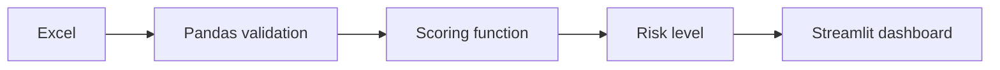

# Stackly Attrition Radar - Presentation Outline

## 1. Opening
**Message:** We built an early-warning dashboard to help HR and team leads prioritize employee retention conversations.

## 2. Business problem
Employee turnover affects cost, productivity, knowledge retention, and team stability. A focused risk view can help managers act earlier.

## 3. What the prototype does
- Reads the Stackly employee Excel workbook.
- Calculates an explainable screening score.
- Groups employees into High, Medium, and Low risk.
- Shows the exact signals behind each flagged employee.
- Supports filtering and individual employee inspection.

## 4. Data
The sample contains 50 employees and includes Employee ID, name, department, job title, email, phone, location, joining date, and employment status.

## 5. Method
This prototype uses a weighted rule-based heuristic, not machine learning, because the workbook has no historical Attrition Yes/No outcome.

Rules include:
- Under 1 year tenure: +35
- 1 to under 2 years tenure: +20
- On Leave: +30
- Probation: +25
- Remote: +10
- Sales or Customer Success: +10

Risk levels:
- 0-29: Low
- 30-54: Medium
- 55-100: High

## 6. Current sample result
- High: 2 employees
- Medium: 2 employees
- Low: 46 employees

Top review list:
- Leah Lee, score 60: under 2 years tenure, on leave, customer-facing team
- Michael Taylor, score 55: under 2 years tenure, probation, remote
- Karan Khan, score 50: under 2 years tenure, on leave
- Neha Singh, score 45: under 2 years tenure, probation

## 7. Live demo sequence
1. Open the dashboard.
2. Show the summary metrics.
3. Show the Likely to leave table.
4. Explain one employee's signals.
5. Filter to High risk.
6. Show risk distribution and department average graphs.
7. Inspect one employee.

## 8. Architecture

## 9. Limitations
- No historical attrition target.
- No trained or validated ML model.
- Score is not a probability.
- Sample is only 50 records.
- Signals are demonstration assumptions and do not prove causation.

## 10. Proposed next phase
- Add historical Attrition Yes/No labels.
- Define an observation window, such as leaving within six months.
- Add approved features such as tenure, promotion history, engagement, workload, and performance trend.
- Train Logistic Regression as an interpretable baseline.
- Compare with a tree-based model.
- Evaluate precision, recall, F1, PR-AUC, calibration, and fairness.
- Add privacy controls, audit logs, monitoring, and human review.

## 11. Closing statement
“This prototype gives us a transparent starting point. The next step is to validate the business assumptions with historical data before calling it a production prediction model.”
